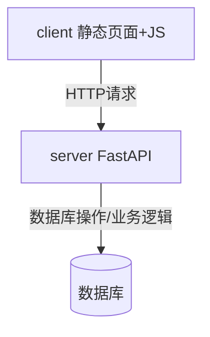

# 项目架构层级总结

## 1. server（后端）
- 技术栈：FastAPI（通过 uvicorn 启动）
- 主要职责：业务逻辑、API接口、数据库操作
- 目录结构：
  - `app/`
    - `main.py`：FastAPI 应用入口
    - `api/v1/`：API 路由分层（如 `orders.py`、`tickets.py`）
    - `core/`：配置与数据库连接（如 `config.py`、`db.py`）
    - `models/`：数据模型与 Pydantic schema
    - `repository/`：数据访问层（如 `order_repo.py`、`ticket_repo.py`）
    - `services/`：业务逻辑层
  - `tests/`：后端测试

## 2. client（前端）
- 技术栈：静态页面 + JavaScript
- 启动方式：`python -m http.server 3000`
- 主要职责：用户交互、界面展示
- 目录结构：
  - `*.html`：各功能页面（flights、inventory、orders、ticket-select 等）
  - `js/`：前端业务逻辑（如 `api.js`、`dashboard.js`、`flights.js` 等）
  - `style.css`：样式文件

## 3. 交互方式
- 前端通过 JS（如 `api.js`）向后端 FastAPI 提供的 RESTful API 发起请求，获取或提交数据，实现页面动态交互。

## 4. 层级关系图



## 5. 常用启动命令

```bash
# 启动后端
cd server
python -m uvicorn app.main:app --reload --host 127.0.0.1 --port 8000

# 启动前端
cd client
python -m http.server 3000
```

## 6. 常用访问地址
- 后端健康页：http://127.0.0.1:8000/
- 后端文档：http://127.0.0.1:8000/docs
- 前端首页：http://127.0.0.1:3000/index.html
- 前端分页面：
  - http://127.0.0.1:3000/flights.html
  - http://127.0.0.1:3000/inventory.html
  - http://127.0.0.1:3000/orders.html
